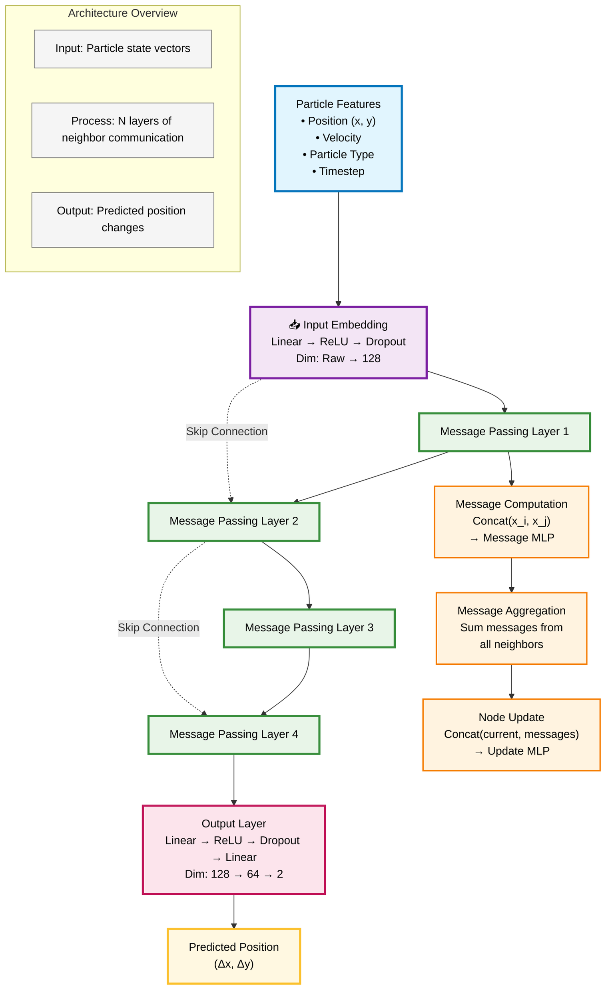
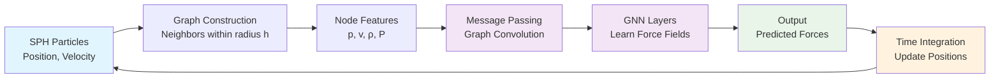

```mermaid
graph TD
    %% Input Stage
    A[" Particle Features<br/>• Position (x, y)<br/>• Velocity<br/>• Particle Type<br/>• Timestep"] --> B["📥 Input Embedding<br/>Linear → ReLU → Dropout<br/>Dim: Raw → 128"]
    
    %% Message Passing Layers
    B --> C[" Message Passing Layer 1"]
    C --> D[" Message Passing Layer 2"] 
    D --> E[" Message Passing Layer 3"]
    E --> F[" Message Passing Layer 4"]
    
    %% Skip Connections
    B -.->|Skip Connection| D
    D -.->|Skip Connection| F
    
    %% Message Passing Detail (expanded for Layer 1)
    C --> C1[" Message Computation<br/>Concat(x_i, x_j)<br/>→ Message MLP"]
    C1 --> C2[" Message Aggregation<br/>Sum messages from<br/>all neighbors"]
    C2 --> C3[" Node Update<br/>Concat(current, messages)<br/>→ Update MLP"]
    
    %% Output Stage
    F --> G[" Output Layer<br/>Linear → ReLU → Dropout → Linear<br/>Dim: 128 → 64 → 2"]
    G --> H[" Predicted Position<br/>(Δx, Δy)"]
    
    %% Styling
    classDef input fill:#e1f5fe,stroke:#0277bd,stroke-width:3px,color:#000
    classDef embedding fill:#f3e5f5,stroke:#7b1fa2,stroke-width:3px,color:#000
    classDef messagepass fill:#e8f5e8,stroke:#388e3c,stroke-width:3px,color:#000
    classDef detail fill:#fff3e0,stroke:#f57c00,stroke-width:2px,color:#000
    classDef output fill:#fce4ec,stroke:#c2185b,stroke-width:3px,color:#000
    classDef result fill:#fff8e1,stroke:#fbc02d,stroke-width:3px,color:#000
    classDef skip stroke:#9e9e9e,stroke-width:2px,stroke-dasharray: 5 5
    
    class A input
    class B embedding
    class C,D,E,F messagepass
    class C1,C2,C3 detail
    class G output
    class H result
    
    %% Graph structure annotation
    subgraph Legend[" Architecture Overview"]
        L1["Input: Particle state vectors"]
        L2["Process: N layers of neighbor communication"]
        L3["Output: Predicted position changes"]
    end
    
    classDef legend fill:#f5f5f5,stroke:#757575,stroke-width:1px,color:#000
    class L1,L2,L3 legend
```

```mermaid
flowchart LR
    A[SPH Particles<br/>Position, Velocity] --> B[Graph Construction<br/>Neighbors within radius h]
    B --> C[Node Features<br/>p, v, ρ, P]
    C --> D[Message Passing<br/>Graph Convolution]
    D --> E[GNN Layers<br/>Learn Force Fields]
    E --> F[Output<br/>Predicted Forces]
    F --> G[Time Integration<br/>Update Positions]
    G --> A
    
    style A fill:#e1f5fe
    style D fill:#f3e5f5
    style E fill:#f3e5f5
    style F fill:#e8f5e8
    style G fill:#fff3e0
```