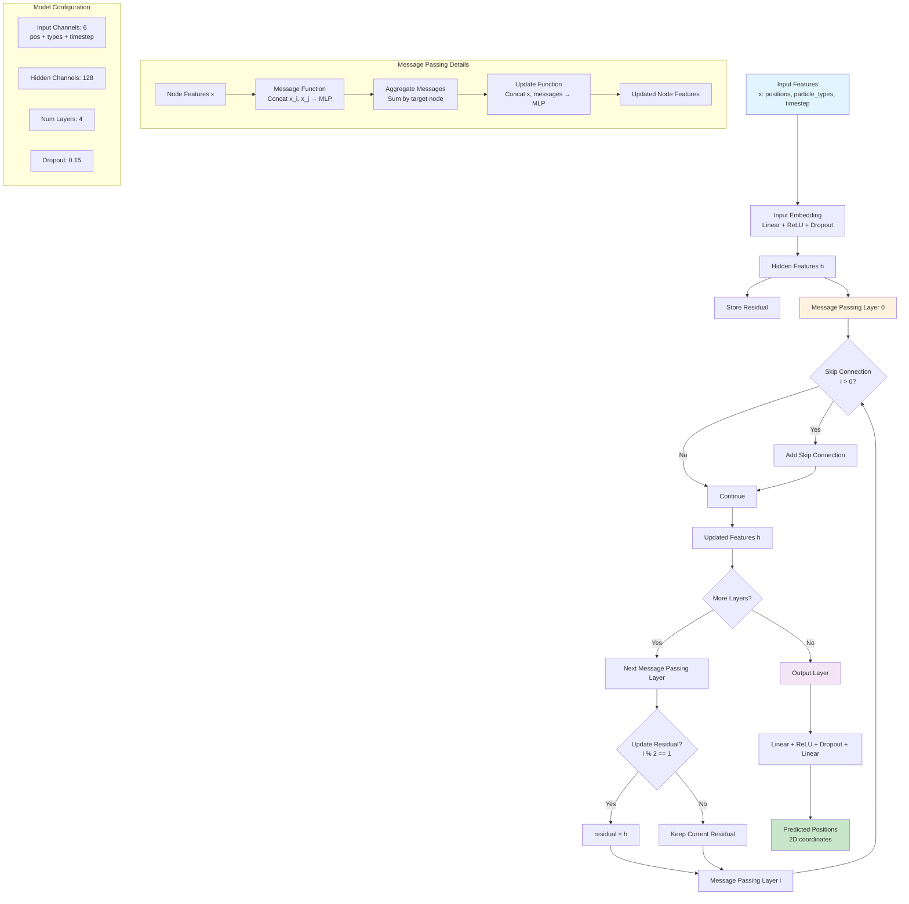

```mermaid
graph TD
    A[Input Features<br/>x: positions, particle_types, timestep] --> B[Input Embedding<br/>Linear + ReLU + Dropout]
    
    B --> C[Hidden Features h]
    C --> D[Store Residual]
    
    C --> E[Message Passing Layer 0]
    E --> F{Skip Connection<br/>i > 0?}
    F -->|Yes| G[Add Skip Connection]
    F -->|No| H[Continue]
    G --> H
    H --> I[Updated Features h]
    
    I --> J{More Layers?}
    J -->|Yes| K[Next Message Passing Layer]
    J -->|No| L[Output Layer]
    
    K --> M{Update Residual?<br/>i % 2 == 1}
    M -->|Yes| N[residual = h]
    M -->|No| O[Keep Current Residual]
    N --> P[Message Passing Layer i]
    O --> P
    P --> F
    
    L --> Q[Linear + ReLU + Dropout + Linear]
    Q --> R[Predicted Positions<br/>2D coordinates]
    
    subgraph "Message Passing Details"
        S[Node Features x] --> T[Message Function<br/>Concat x_i, x_j → MLP]
        T --> U[Aggregate Messages<br/>Sum by target node]
        U --> V[Update Function<br/>Concat x, messages → MLP]
        V --> W[Updated Node Features]
    end
    
    subgraph "Model Configuration"
        X[Input Channels: 6<br/>pos + types + timestep]
        Y[Hidden Channels: 128]
        Z[Num Layers: 4]
        AA[Dropout: 0.15]
    end
    
    style A fill:#e1f5fe
    style R fill:#c8e6c9
    style E fill:#fff3e0
    style L fill:#f3e5f5
```